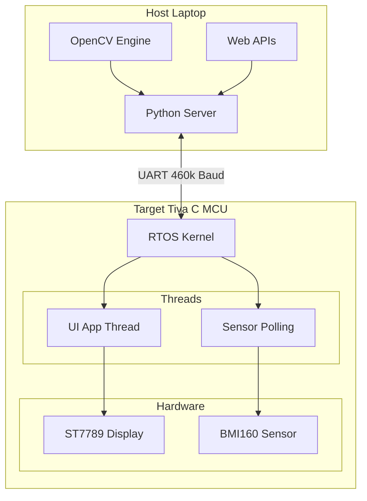
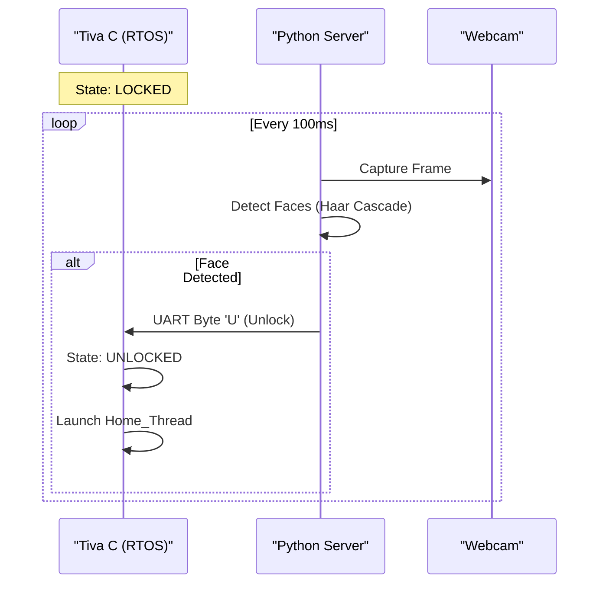

# Real-Time Phone & Smart Console (RTOS)
*A preemptive, multithreaded embedded operating system featuring biometric security, cloud connectivity, and real-time gaming.*

[](#license)
[](https://www.ti.com/tool/EK-TM4C123GXL)
[](https://www.python.org/)
[](#)

---

## Project Overview
This project demonstrates a full-stack embedded system built from scratch. It splits computational loads between a **Tiva C Microcontroller** (handling real-time graphics, inputs, and sensor fusion) and a **Python Host Server** (handling heavy computer vision and API requests).

The system runs on **RTOS**, a custom-written RTOS kernel supporting semaphores, FIFOs, and priority scheduling to ensure fluid 60FPS UI performance while handling high-speed UART interrupts.

---

## Key Features

| Category | Highlight |
| :--- | :--- |
| **Biometric Security** | **Face Unlock** using Haar Cascades (OpenCV) running on the host, communicating state via UART. |
| **Cloud Apps** | **Weather & Location** apps fetch live JSON data from `wttr.in` and IP-APIs, parsed on-chip. |
| **Streaming Media** | **Live Camera** feed streams raw RGB565 frames from laptop to MCU over 460k baud UART. |
| **Gaming** | **Frogger** clone with object pooling, AABB collision detection, and localized delta-drawing. |
| **Sensor Fusion** | **Compass** app reads BMI160 magnetometer vectors via I2C for real-time heading calculation. |
| **Kernel** | **Preemptive Scheduler** with non-blocking IPC (Inter-Process Communication) and starvation prevention. |

---

## 📸 Gallery

| **Lock Screen (Face ID)** | **Home Menu** | **Live Camera** |
|:---:|:---:|:---:|
|  |  |  |
| *Secure entry with real-time clock* | *Joystick-navigable app grid* | *Video streaming from Host* |

| **Live Weather** | **Digital Compass** | **Frogger Game** |
|:---:|:---:|:---:|
|  |  |  |
| *Live API data via UART* | *Real-time magnetometer data* | *Physics, collisions & sprites* |

---

## High-Level Architecture

The system utilizes a **Client-Server model** over a physical UART bridge. The MCU handles the Real-Time requirements (UI, Sensors), while the PC handles heavy computation.



  ## 🧵 Multithreading Model

The RTOS kernel manages resources using **Semaphores** (for the I2C bus and SPI Display) and **FIFOs** (to pass joystick data to game threads).

| Task/Thread | Priority | Resource Usage | Function |
| :--- | :---: | :--- | :--- |
| **UART_Handler** | Highest (ISR) | Hardware FIFO | Captures incoming bytes immediately to prevent buffer overrun. |
| **RTOS_Scheduler**| Kernel | SysTick | Context switches between active threads. |
| **App_Thread** | High | SPI / Display | Runs the active application (Frogger, Camera, etc.). |
| **Sensor_Thread** | Medium | I2C Bus | Polls BMI160 and Joystick; posts data to OS FIFOs. |
| **Idle_Thread** | Lowest | None | Low-power sleep when no tasks are active. |

---

## 📡 Communication & Data Processing

### Sequence Diagram: Face Unlock
This diagram illustrates the handshake between the MCU and the Python Host to perform the secure unlock.



### Image Compression (Math)

To stream video over UART, the Python host compresses standard 24-bit Web color into **16-bit RGB565** before transmission. This reduces bandwidth by 33%, allowing for higher framerates.

**The Bitwise Conversion Law:**

```c
// Convert RGB888 to RGB565
uint16_t Pixel_16 = ((R & 0xF8) << 8) | ((G & 0xFC) << 3) | (B >> 3);
```

Where:
* **Red:** 5 bits (Mask `0xF8`)
* **Green:** 6 bits (Mask `0xFC`)
* **Blue:** 5 bits (Shifted right)

---

## 📡 Communication Protocol (UART)

The system relies on a high-speed **460,800 baud** UART connection. The MCU acts as the client, sending single-character commands, and the Python server responds with data packets.

| Command | Direction&nbsp;&nbsp;&nbsp;&nbsp;&nbsp;&nbsp;&nbsp;&nbsp;&nbsp;&nbsp;&nbsp;&nbsp; | Description | Response Data Format |
| :--- | :--- | :--- | :--- |
| `'U'` | Python → MCU | **Unlock Signal.** Sent automatically when OpenCV detects a face. | None (State change) |
| `'T'` | MCU → Python | **Time Request.** Fetches current system time. | String: `"12:45 PM"` (null-terminated) |
| `'W'` | MCU → Python | **Weather Request.** Fetches live weather from `wttr.in`. | String: `"City\nTemp\nCondition\nHum/Wind"` |
| `'C'` | MCU → Python | **Location Request.** Fetches GPS coordinates via IP API. | String: `"Lat: 12.34, Lon: -56.78"` |
| `'P'` | MCU → Python | **Photo Request.** Fetches a single frame from the webcam. | Raw Bytes: RGB565 pixel data (High/Low byte) |

---

## 📂 Project Structure

* `Threads.c`: Main application logic, UI drawing, and app definitions.
* `Camera.py`: Host-side processing for AI, Internet, and Time.
* `RTOS/`: Core OS kernel files (Scheduler, Semaphores, IPC).
* `MultimodDrivers/`: Hardware drivers for ST7789 (Display), BMI160 (IMU), and Buttons.
* `Bitmaps/`: Header files containing pixel arrays for app icons (`Camera.h`, `Weather.h`, etc.).